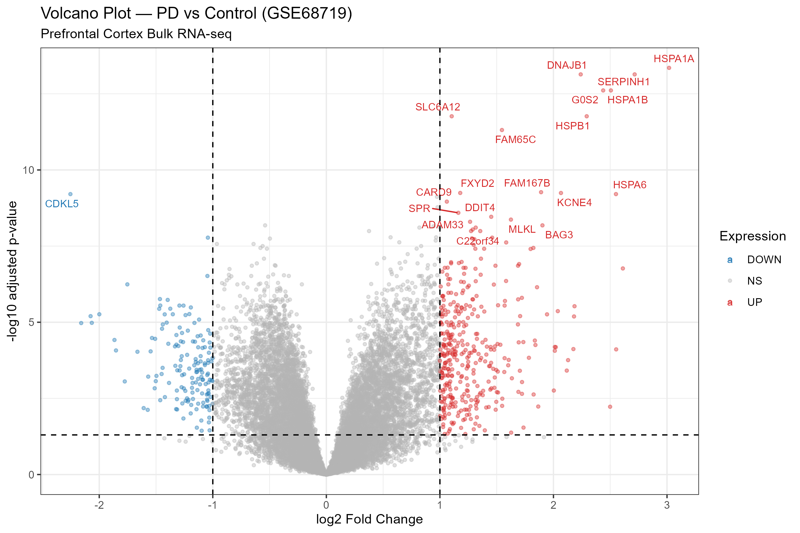
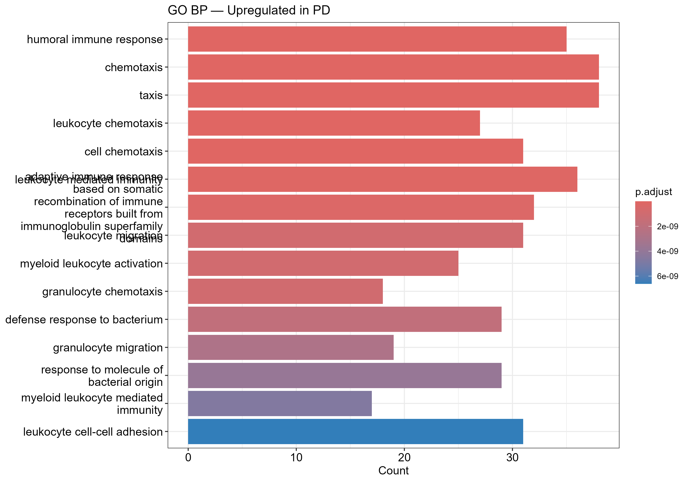

# Bulk RNA-seq Differential Expression Analysis — Parkinson's Disease Prefrontal Cortex


---

## Overview

End-to-end bulk RNA-seq differential expression analysis comparing **Parkinson's Disease (PD)** vs **healthy control** prefrontal cortex samples using the public dataset **GSE68719** from NCBI GEO.

The analysis identifies dysregulated genes, performs pathway enrichment, and produces publication-quality visualizations to characterize transcriptomic changes in PD brain tissue.

---

## Dataset

| Field | Details |
|---|---|
| **GEO Accession** | [GSE68719](https://www.ncbi.nlm.nih.gov/geo/query/acc.cgi?acc=GSE68719) |
| **Tissue** | Prefrontal Cortex (PFC) |
| **Condition** | Parkinson's Disease vs Control |
| **Organism** | *Homo sapiens* |
| **Data type** | Pre-normalized count matrix (PCG) |

---

## Analysis Pipeline

```
GEO Download (GEOquery)
        │
        ▼
Count Matrix Load + QC
        │
        ▼
DESeq2 Normalization & DE Analysis
  ├── Design: ~ condition (PD vs Control)
  ├── Pre-filter: rowSums(counts ≥ 10) ≥ 5
  └── Contrast: PD vs Control
        │
        ▼
Result Filtering
  ├── |log2FC| > 1
  └── padj < 0.05 (BH correction)
        │
        ▼
Visualization
  ├── Volcano plot (plain + labeled)
  └── Top 30 DE genes heatmap (z-scored)
        │
        ▼
Pathway Enrichment
  └── GO Biological Process (clusterProfiler)
      ├── Upregulated genes
      └── org.Hs.eg.db annotation
```

---

## Key Results

| Metric | Value |
|---|---|
| Total genes tested | 16,601 |
| **Upregulated in PD** | **383** |
| **Downregulated in PD** | **151** |
| Significance threshold | padj < 0.05, \|log2FC\| > 1 |

### Top Upregulated Genes in PD

| Gene | log2FC | padj | Function |
|---|---|---|---|
| HSPA1A | ~3.1 | < 1e-13 | Heat shock protein, stress response |
| HSPA1B | ~2.9 | < 1e-13 | Heat shock protein family member |
| DNAJB1 | ~2.4 | < 1e-13 | HSP40 co-chaperone |
| SERPINH1 | ~2.7 | < 1e-13 | Collagen chaperone |
| HSPB1 | ~2.2 | < 1e-11 | Small heat shock protein |

> **Biological insight:** Upregulation of multiple heat shock proteins (HSPA1A, HSPA1B, HSPB1, DNAJB1) points to proteostatic stress and protein misfolding in PD prefrontal cortex — consistent with known α-synuclein aggregation biology.

### Top Downregulated Gene

| Gene | log2FC | padj | Function |
|---|---|---|---|
| CDKL5 | ~-2.3 | < 1e-9 | Kinase involved in neuronal signaling |

### GO Biological Process — Upregulated in PD

Top enriched pathways (BH-adjusted p < 0.05):
- Humoral immune response
- Chemotaxis / leukocyte chemotaxis
- Adaptive immune response
- Myeloid leukocyte activation
- Defense response to bacterium

> **Insight:** Neuroinflammatory and immune activation signatures dominate the upregulated gene set, supporting the role of neuroinflammation in PD pathophysiology.

---

## Visualizations

### Volcano Plot


### GO Enrichment — Upregulated in PD


---

## Repository Structure

```
01-bulk-rnaseq-pd/
├── analysis/
│   └── p1P3.R                        # Full analysis script
├── results/
│   ├── GSE68719_DESeq2_results.csv   # All DE results
│   └── figures/
│       ├── GSE68719_volcano.png
│       ├── GSE68719_volcano_labeled.png
│       ├── GSE68719_heatmap.png
│       └── GSE68719_GO_up.png
└── README.md
```

---

## How to Reproduce

### Requirements

```r
install.packages(c("ggplot2", "ggrepel", "pheatmap"))

if (!require("BiocManager")) install.packages("BiocManager")
BiocManager::install(c("GEOquery", "DESeq2", "clusterProfiler", "org.Hs.eg.db"))
```

### Run

```r
# 1. Clone repo
# 2. Open analysis/p1P3.R in RStudio
# 3. Run end-to-end — data downloads automatically from GEO
```

> Note: GEO download requires internet. Workspace snapshot saved as `.RData` for offline re-analysis.

---

## Tools & Packages

| Tool | Purpose |
|---|---|
| GEOquery | Download GSE68719 from NCBI GEO |
| DESeq2 | Normalization + differential expression |
| ggplot2 + ggrepel | Volcano plots |
| pheatmap | Heatmap visualization |
| clusterProfiler | GO enrichment analysis |
| org.Hs.eg.db | Human gene annotation |

---

## Author

**Ganapathirajan P**
MSc Bioinformatics & Data Science — Sathyabama Institute of Science and Technology

[](https://www.linkedin.com/in/grp1)
[](https://github.com/Ganapathirajan)

---

## License

MIT License — see [LICENSE](LICENSE)
